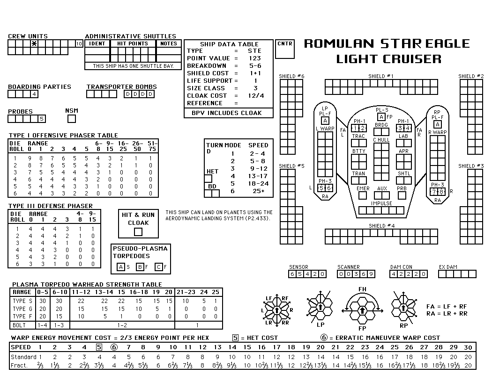

# Star Fleet Battles SSD HTML Checkbox Maker
This tool will take an SSD image (approx. 1050 x 800) and create an HTML file with the image as a background, and super impose checkboxes where appropriate.

## Usage
```
# create a single SSD HTML and CSS using the supplied image
python full_ssd.py <image_file>

# create SSD HTML and CSS files for all the SSDs in the directory
./generate_ssd.sh
```
## Sample Input


## Live Sample Results

### Federation
- [Federation DNP Heavy Plasma Dreadnought](https://jcdietrich.github.io/sfb-ssd/fed-dnp-heavy-plasma-dreadnought.html)
- [Federation Heavy Cruiser](https://jcdietrich.github.io/sfb-ssd/fed-heavy-cruiser.html)

## Romulan
- [Romulan Star Eagle Light Cruiser](https://jcdietrich.github.io/sfb-ssd/rom-star-eagle.html)

## Hydran
- [Hydran Rino Hunter War Destroyer (bad scan)](https://jcdietrich.github.io/sfb-ssd/hydran-rino-hunter-war-destroyer.html)


